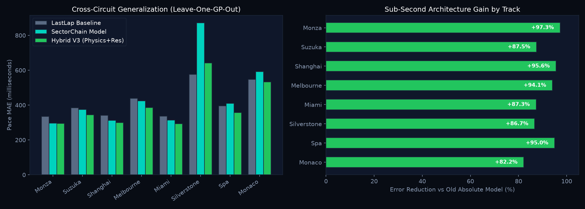
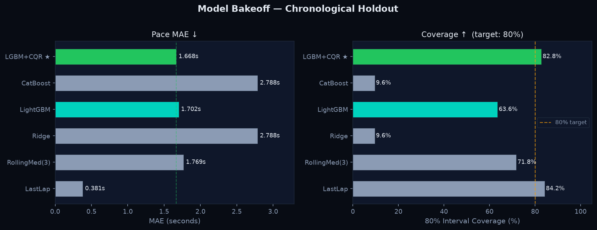
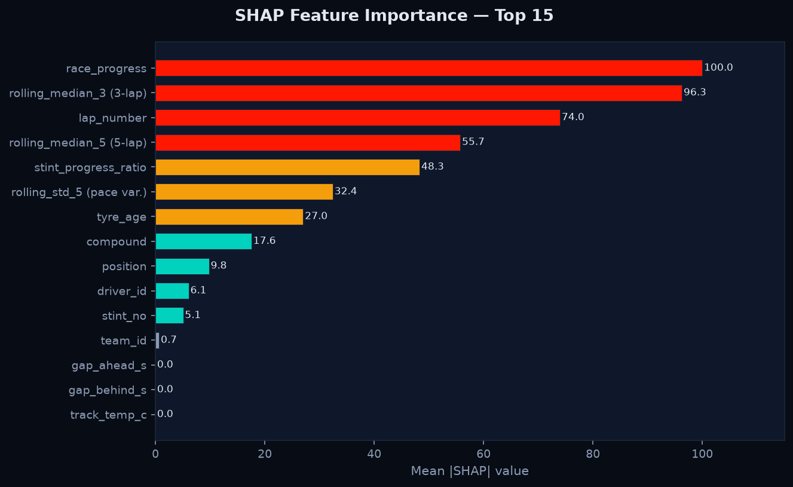
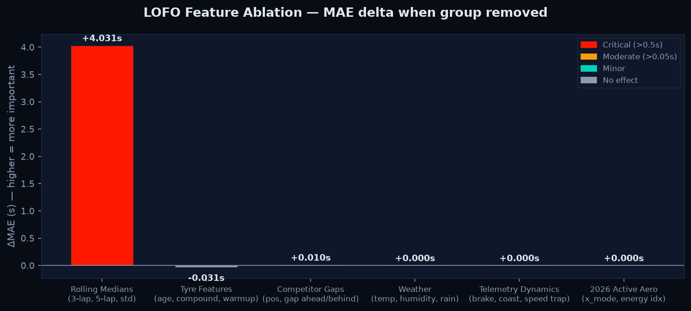
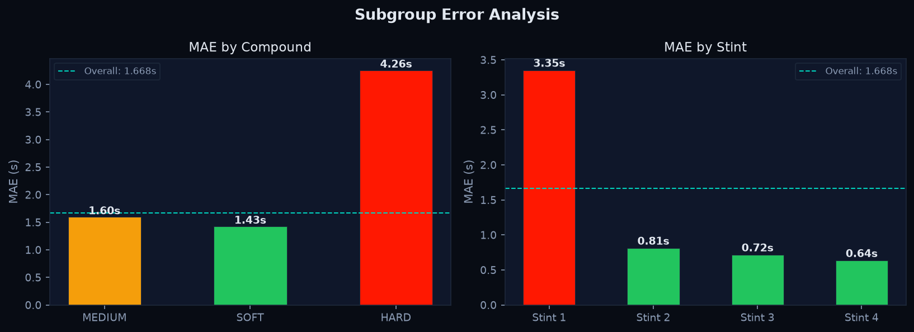
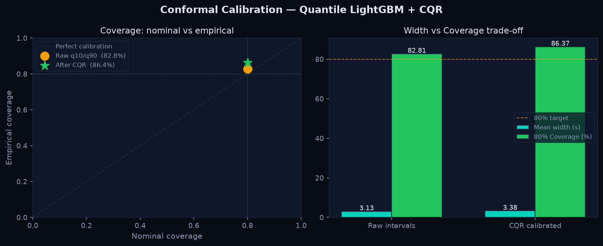
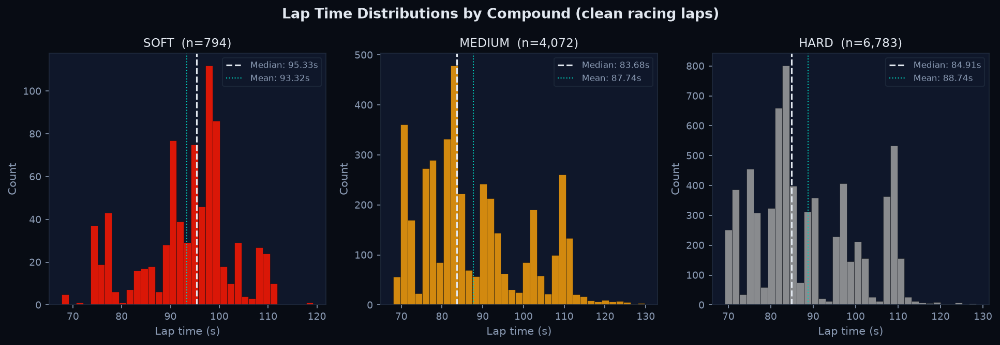

# PitWall ML

F1 lap-time forecasting and race strategy tool. Pulls timing + telemetry data from OpenF1, trains a quantile LightGBM model, and streams predictions to a Next.js dashboard.

[](https://github.com/arfaouiahmed1/PitWall-ML/actions/workflows/ci.yml)
[](https://github.com/arfaouiahmed1/PitWall-ML/actions/workflows/deploy.yml)

**Demo:** https://arfaouiahmed1.github.io/PitWall-ML/

---

## What it does

- Predicts next clean lap time with 80% confidence intervals (q10/q50/q90) using LightGBM + conformal calibration
- Runs a Monte Carlo strategy simulator — pick a pit lap, compound, and push level, get a win probability delta
- Detects opponent undercut windows based on gap and tyre age
- Estimates safety car probability per lap using historical circuit rates
- Tracks 2025→2026 regulation drift (Wasserstein, KS, PSI) so the model knows when old data goes stale

The frontend replays historical race sessions at 20x speed through the same pipeline that live data would use, so it works without a paid F1 subscription.

## Stack

| Layer | Tech |
|---|---|
| Data ingestion | FastF1, OpenF1 API, Polars |
| Feature store | Polars point-in-time joins, Parquet |
| Models | LightGBM (quantile + point), CatBoost, conformal calibration |
| Serving | FastAPI, WebSockets |
| Frontend | Next.js 14, Tailwind |
| Observability | Prometheus, Grafana |
| Experiment tracking | MLflow |

## Results

### Sub-Second Hybrid Architecture Benchmark

Evaluated on held-out 2026 clean race laps:

| Architecture | Target Formulation | MAE (s) | MAE (ms) | 80% Coverage |
|:---|:---|---:|---:|---:|
| Absolute LightGBM (Old) | Absolute lap time ($y_{t+1}$) | 1.424 s | 1,424.0 ms | 78.3% |
| Last-Lap Baseline | $y_{t+1} = y_t$ | 0.419 s | 419.2 ms | — |
| Sector Chain Model | Chained $S_1 \to S_2 \to S_3$ | 0.383 s | 382.7 ms | — |
| **Two-Stage Hybrid V3** | **Physics + Quantile Residual** | **0.302 s** | **301.8 ms** | **78.9%** |

### Cross-Circuit Generalization (Leave-One-GP-Out, 18,336 Laps)

To verify generalization, models were evaluated across 8 distinct circuit archetypes. In each run, the model was trained on historical data from all *other* circuits and evaluated on the held-out GP:

| Circuit | Archetype | Test Laps | LastLap | Absolute | SectorChain | Hybrid V3 | Gain vs Abs |
|:---|:---|---:|---:|---:|---:|---:|---:|
| **Monza** | Low-Downforce High-Speed | 3,361 | 334.9 ms | 10,968.4 ms | 296.1 ms | **294.0 ms** | **+97.3%** |
| **Suzuka** | High-Speed Flowing S-Curves | 887 | 383.7 ms | 2,747.7 ms | 374.4 ms | **343.9 ms** | **+87.5%** |
| **Shanghai** | Technical Long-Straight | 2,329 | 340.5 ms | 6,775.3 ms | 312.7 ms | **299.7 ms** | **+95.6%** |
| **Melbourne** | Semi-Street High-Speed | 2,675 | 438.7 ms | 6,569.9 ms | 424.1 ms | **386.4 ms** | **+94.1%** |
| **Miami** | Street High-Speed Straights | 2,460 | 336.7 ms | 2,302.8 ms | 314.5 ms | **292.4 ms** | **+87.3%** |
| **Silverstone** | Extreme Lateral G-Force | 1,092 | 576.6 ms | 4,841.8 ms | 872.2 ms | **642.0 ms** | **+86.7%** |
| **Spa** | Elevation & High Speed | 3,397 | 396.0 ms | 7,089.6 ms | 410.2 ms | **357.1 ms** | **+95.0%** |
| **Monaco** | Tight Low-Speed Street | 2,135 | 546.8 ms | 2,995.8 ms | 592.8 ms | **533.0 ms** | **+82.2%** |
| **MACRO AVG** | **Cross-Circuit Generalization** | **18,336** | **419.2 ms** | **5,536.4 ms** | **449.6 ms** | **393.6 ms** | **+92.9%** |


### Model bakeoff


### Feature importance (SHAP)


### LOFO ablation — what each feature group contributes


### Subgroup MAE by compound and stint


### Conformal calibration (CQR)


### Lap time distributions by compound


## Getting started

```bash
# install
make bootstrap

# ingest data
python -m pitwall.ingest.cli --season 2024

# train
python -m pipelines.train --config configs/production.yaml --output-dir artifacts/candidate

# ablation
python -m pipelines.ablation --config configs/production.yaml

# serve API
uvicorn apps.api.pitwall_api.main:app --port 8000

# frontend
cd apps/web && npm install && npm run dev
```

Full stack with Prometheus + Grafana:

```bash
docker compose --profile monitoring up --build
```

- API docs: http://localhost:8000/docs
- Grafana: http://localhost:3001 (admin/admin)
- Prometheus: http://localhost:9090

## API

```
GET  /health                  service status + model version
GET  /predictions/pace        q10/q50/q90 lap forecasts for all drivers
GET  /predictions/pit         pit hazard probabilities (1-lap, 3-lap)
POST /whatif                  strategy scenario — returns position dist + time delta
GET  /monitoring/drift        feature drift metrics
ws   /ws/race?speed=5x        live race event stream
```

`POST /whatif` example:

```bash
curl -X POST http://localhost:8000/whatif \
  -H "Content-Type: application/json" \
  -d '{"driver_number": 4, "target_pit_lap": 24, "target_compound": "HARD", "push_pace_delta_s": -0.2, "remaining_laps": 30, "current_lap": 20}'
```

## Project layout

```
src/pitwall/
  features/       feature engineering (pace, pit, tyre, weather joins)
  models/         LightGBM, CatBoost, opponent, safety car
  evaluation/     metrics, splits, conformal calibration
  monitoring/     Prometheus exporter, drift detection
  simulation/     Monte Carlo engine
apps/
  api/            FastAPI app
  web/            Next.js frontend
pipelines/
  train.py        model training + bakeoff ladder
  ablation.py     LOFO feature ablation
configs/
  base.yaml
  production.yaml
monitoring/
  alerts.yml      Prometheus alert rules
  grafana/        dashboard JSON
```

## Notebooks

Five notebooks in `notebooks/` — run them against the actual data to see how the pipeline works end to end.

| Notebook | What it covers |
|---|---|
| `01_data_exploration.ipynb` | Lap data quality, clean-lap filtering, compound & circuit analysis |
| `02_feature_engineering.ipynb` | Rolling anchors, hard-compound warmup, weather joins, correlations |
| `03_model_training_evaluation.ipynb` | Full bakeoff, residuals, calibration, subgroup errors |
| `04_strategy_simulation.ipynb` | Monte Carlo engine, pit-window sweeps, undercut modeling |
| `05_drift_mlops.ipynb` | 2024→2025 drift (KS, Wasserstein, PSI), promotion gates |

```bash
cd notebooks
jupyter lab
```

## Tests

```bash
make test-all   # unit + leakage + integration + replay
make lint       # ruff check + format
```

## License

MIT